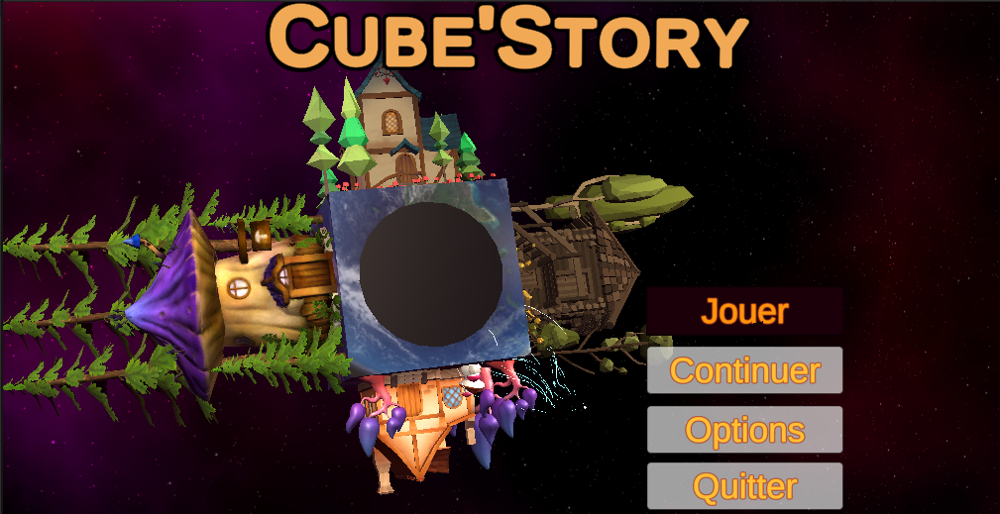

---
# **CUBE STORY**
---

Ce projet est né d'une équipe de deux insaïens passionnés d'ingénierie. Nous souhaitons mettre sur pied une nouvelle façon de découvrir des histoires, en mélant l'informatique spatiale au récit.

La personne utilisatrice pourra entrer en immersion dans des histoires par le biais d'un casque de réalité virtuelle, et d'un cube composé de 5 touches qui lui permettront de se déplacer et de prendre des décisions. Ce cube est alors le symbole du projet: la personne utilisatrice va virtuellement rentrer dans ce cube et découvrir des histoires qui vont la faire voyager.

Profitez d'un apperçu de l'écran initial, avant de rentrer en immersion parmis un choix de 1 histoire:

La première histoire que nous proposerons en exclusivité est **La Légende d'Iponia**, imaginée et écrite par Aurore Le Mercier.

## ***Choix des histoires***

Au départ, vous allez arriver dans une galerie. Dans cette galerie, les histoires vous seront proposé et vous pourrez les choisir grace a un rayon qui rends les tableaux selectionnables. En l'occurence, nous n'avons qu'une histoire et donc un seul tableau qui a cette possibilité.

## ***Première histoire : La légende d'Iponia***

Cette histoire vient se dérouler en 4 grandes scènes. Dans cette histoire, vous incarnez Iponia, le personnage principal.

Nous avons une première scène représentant deux personnages : Votre père et un chevalier. Cette scène est contemplatif pour une introduction en douceur de l'histoire. Pour faciliter la compréhension, les personnages viendront changer de couleur quant ils parlent. Vous aurez également des animations qui seront proposer dans le but d'améliorer l'immersion. Ainsi vous découvrez ce que vous reserves votre destin.

La deuxieme scène vient proposer davantage d'animation et de vie dans la scène. Malgré tout, elle reste encore beaucoup dans la contemplation mais vient integré un élément de choix. Vous allez pouvoir grace a deux touches faire un choix qui va changer la réaction de votre environnement. Ainsi, on a réalisé un doublage qui va différé entre les deux options. Les animations sont également adapté aux choix.

Après ces deux scènes d'introduction, vient la scène ou aller pouvoir vous déplacer et interagir avec votre environnement. Tous les décors de chaque scène a été mis en place par notre équipe en plus des systemes de interaction puisque les modules déjà present sont fait pour des controllers et dans notre cas, nous sommes avec des touches. Pour cette scène nous avons donc mis en place : 
- Un rayon qui permet d'attraper les objets et de les garder avec nous si maintenu.
* Un systeme de déplacement en continuous move ou vous vous diriger en avant en fonction de la ou vous regarder.
+ Des audios qui vous donneront les directives a suivre.
- Un systeme de sortie avec un object a trouvé.
* Des indications de panneau pour aider dans la recherche qui viennent changer d'écriture en fonction de l'avancé
+ Animation pour la sortie
- Un périmètre autour de la maison afin de pouvoir laisser le joueur visité et dès qu'il sort du perimetre alors la suite de l'histoire se lance
* Un autre systeme de sortie différent réalisé grace a un code
+ Pour le code, une enigme a été mise en place quand on selectionne un papier particulier dans la scène comme s'il se déroulait.
- Un cube est présent dans la salle et permet de rentrer le code qui s'affiche en même temps.
* Une nouvelle animation de sortie
+ La suite de l'histoire est fait de perimetre ou de cercle lumineux/indicatif pour le joueur afin qu'il sache ou se mettre.
- Des doublages excellents !

A la fin de l'histoire, vous revenez dans la galerie des choix pour en apprendre plus sur la voix de narration et puis le jeu est finit. Celui ci fait a peu près 30 min de jeu. Il y a environ 5 personnages qui parlent avec une quinzaine de personnages différents qui sont tout animé. Deux systemes de sortie différentes. Deux chemins dans l'histoire possible. 

Un seul plaisir a faire cette superbe histoire !
